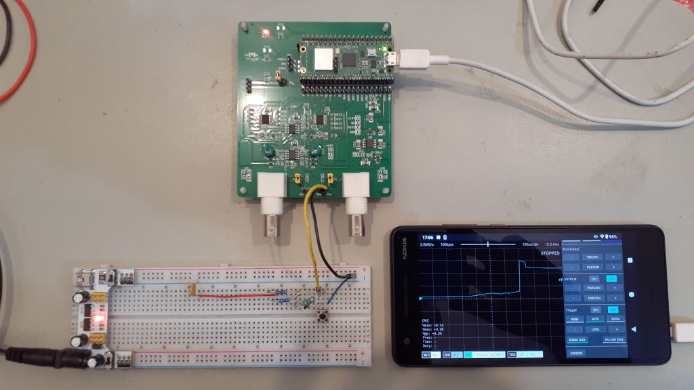
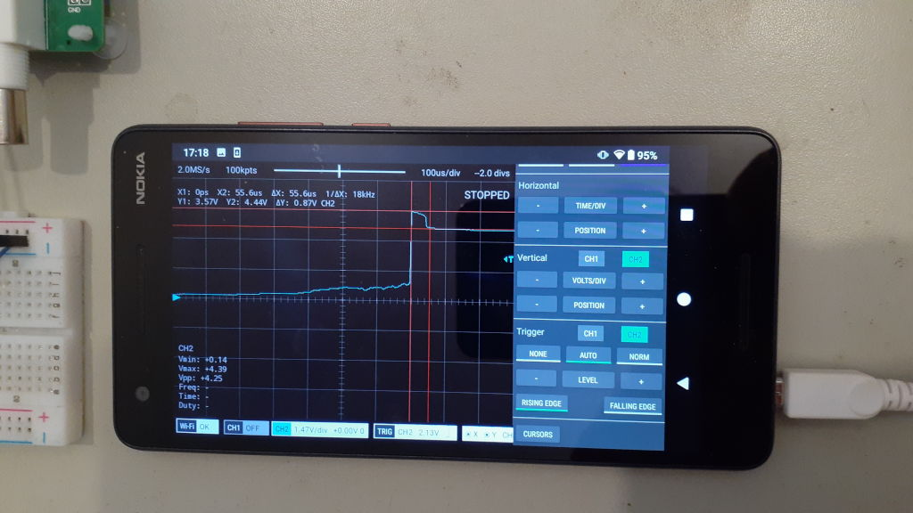
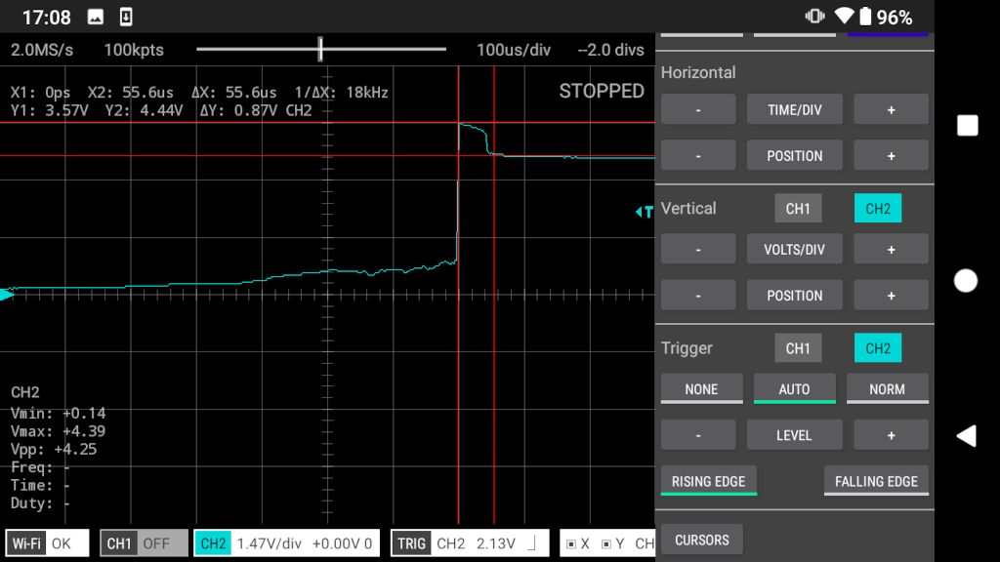

PROTECTION WITH A DIODE ACROSS THE INDUCTOR
-------------------------------------------

### Setup

* Supply voltage of 3.5V
* 500R resistance on the input (2 x 1000R in parallel)
* 1mH inductor
* A 1N4148 diode across the inductor as shown in figure 1.84 of AOE.

### How To

* Press the switch and the voltage on the oscilloscope will be around 0V.
* Tap the 'SINGLE' button and once you see 'WAITING FOR TRIGGER', release the switch.

### Results

* After releasing the switch the voltage increases to about 0.9V above the supply voltage and takes
about 50uS to decay to the supply voltage.

 

#### Is the maximum voltage what I expected?

I expect the maximum voltage to be one diode drop above the supply voltage.
The current at the time of release of the switch is 7mA. Looking at figure 5 of the onsemi datasheet for the 1N4148, Vf
is approx 0.88V at 7mA. That seems OK :)

#### Is the decay time what I expected?

Hmmm. I don't know how to calculate that. If you do, please enlighten us by posting a comment in the [forum](https://github.com/fhdm-dev/scoppy-experiments/discussions). 

