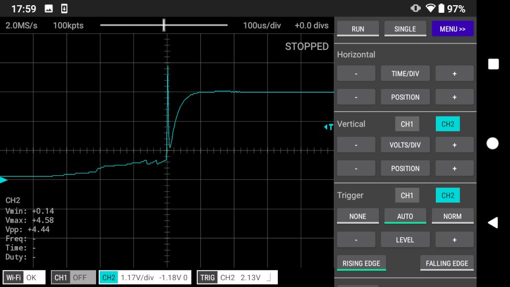

PROTECTION WITH A RESISTOR ACROSS THE INDUCTOR
------------------------

### Setup

The same as the Diode experiment but with a 470R resistor across the inductor instead of a diode. 

### Results

According to AEO, the maximum voltage will be Vsupply + IR which I calculate to be (3.5V + 470R * 7mA) = 6.8V.
However, the measured maximum voltage is only 5.3V.

In other words the voltage spike above Vsupply is only 1.8V where 3.3V was expected. [Thoughts anyone?](https://github.com/fhdm-dev/scoppy-experiments/discussions).
