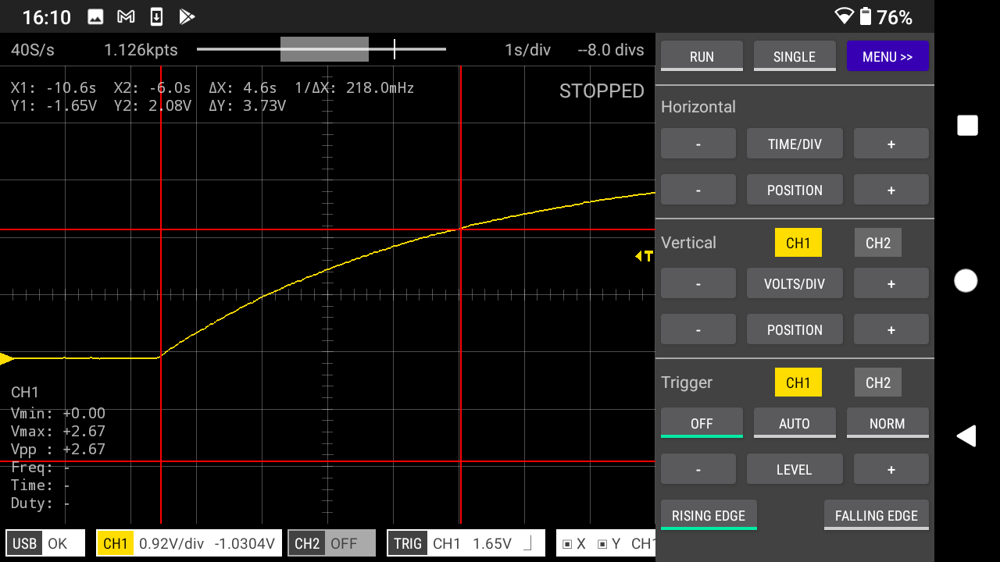

# Scoppy experiments
## [1. Capacitor charging and discharging - Roll Mode](experiments/capacitor-charging-discharging-roll-mode/)
Use roll mode to view in real-time the voltage change across a capacitor. User cursors to measure the time it takes to charge the capacitor to 63% of the input voltage - hopefully this will be equal to the time constant of the RC circuit.

